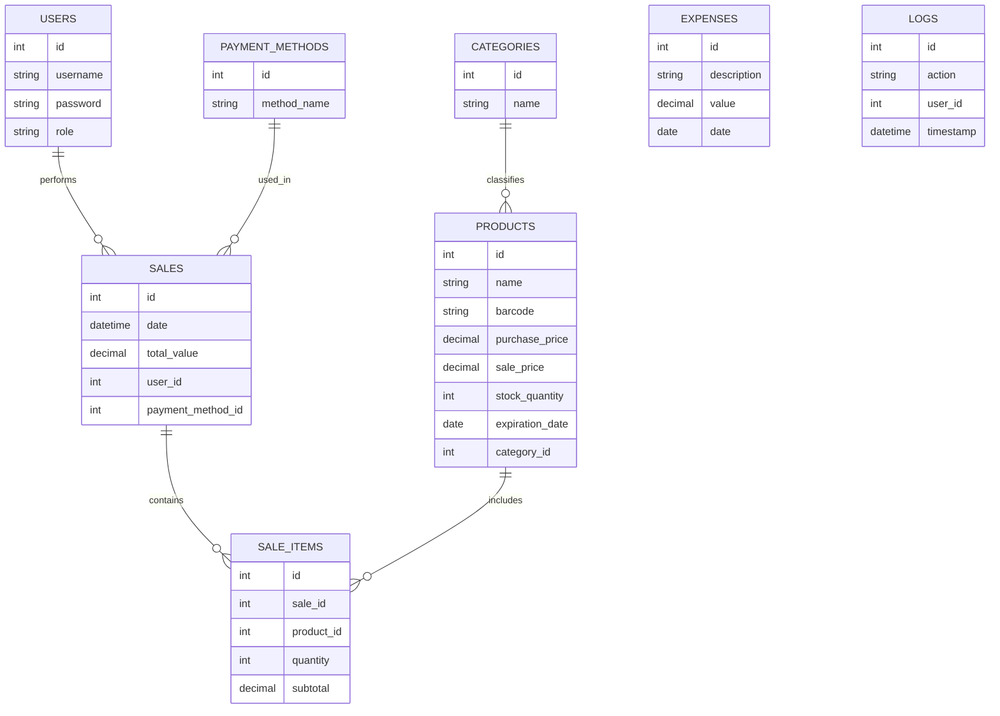

# 🛒 Family Grocery Store — Backend

Backend system for managing sales, inventory, and products of a local grocery store.  
Developed in **Java Spring Boot** with **MySQL** for data persistence.  
This project is part of a full application that includes both backend and frontend (Vue.js).

---

## 📋 Project Overview

The main goal of this system is to help store administrators and employees manage sales, stock, and reports in a simple and efficient way.  
The application is divided into modules covering user authentication, product and stock control, sales management, expense tracking, and reports.

---

## 🧾 Project Objectives

- `Simplify daily operations in grocery management.`
- `Optimize stock control with automatic updates after sales.`
- `Provide insightful reports and sales tracking.`
- `Support multi-user access with secure authentication.`
- `Enable future integration with a Vue.js frontend.`

---

## 🚀 Technologies Used

| Technology | Purpose |
|-------------|----------|
| **Java 17+** | Main backend programming language |
| **Spring Boot 3** | Framework for API and backend logic |
| **Spring Data JPA** | ORM for database integration |
| **MySQL** | Relational database for data persistence |
| **Spring Security** | Authentication and authorization |
| **Lombok** | Simplifies Java code with annotations |
| **Maven** | Dependency and build management |
| **JUnit & Mockito** | Automated testing framework |
| **Docker (optional)** | Containerized deployment |

---

## ⚙️ Project Dependencies

- `spring-boot-starter-data-jpa`
- `spring-boot-starter-security`
- `spring-boot-starter-web`
- `spring-boot-starter-test`
- `mysql-connector-j`
- `lombok`
- `jjwt` *(for JWT authentication)*

---

## 🧩 Functional Requirements

| Code | Requirement | Description | Status |
|------|--------------|-------------|---------|
| RF01 | **User Login** | Allow users to log in and log out. | ⬜ |
| RF02 | **Access Control** | Different permissions for Admin and Employee (“Sílvio”). | ⬜ |
| RF03 | **Product Registration** | Add products with name, barcode, purchase/sale price, profit, expiration, and category. | ⬜ |
| RF04 | **Edit Products** | Modify registered product data. | ⬜ |
| RF05 | **Delete Products** | Remove products from the system. | ⬜ |
| RF06 | **Search Products** | Search by name or barcode. | ☑️ |
| RF07 | **Stock Control** | Automatically update stock after sales or product addition. | ☑️ |
| RF08 | **Sales Record** | Record each sale, including products, quantity, total value, and payment method. | ☑️ |
| RF09 | **Stock Reduction** | Automatically decrease stock when confirming a sale. | ⬜ |
| RF10 | **Payment Methods** | Register payment types (cash, card, credit, etc.). | ⬜ |
| RF11 | **Credit Sales** | Register unfinished or credit (“on account”) sales. | ⬜ |
| RF12 | **Sales Reports** | Generate reports with sales, products, and categories. | ⬜ |
| RF13 | **Sales Statistics** | Show total sales per month, average by time, top products, etc. | ⬜ |
| RF14 | **Download Reports** | Allow report download in PDF format. | ⬜ |
| RF15 | **Invoice Printing** | Print sale receipts. | ⬜ |
| RF16 | **Expense Panel** | Display and register general store expenses. | ⬜ |
| RF17 | **Shopping List** | Manage product restock list. | ⬜ |
| RF18 | **Cancel Shopping List** | Option to cancel all items in shopping list. | ⬜ |
| RF19 | **Auxiliary Registration** | Manage categories and payment methods. | ⬜ |
| RF20 | **System Logs** | Record user actions (registrations, deletions, sales, etc.). | ⬜ |
| RF21 | **Side Menu** | Implement collapsible navigation menu between modules. | ☑️ |

---

## 🧱 Non-Functional Requirements

| Code | Requirement | Description |
|------|--------------|-------------|
| RNF01 | **Language & Framework** | Backend developed in Java with Spring Boot. |
| RNF02 | **Database** | MySQL used for persistence. |
| RNF03 | **Frontend** | Developed with Vue.js. |
| RNF04 | **Security** | Passwords and sensitive data encrypted. |
| RNF05 | **Usability** | Simple, responsive, and intuitive interface. |
| RNF06 | **Performance** | Response time under 2 seconds. |
| RNF07 | **Reports** | PDF reports must be organized and readable. |

---

## 🗄️ Database Diagram



---

## 🧰 How to Run Locally
### 1. Clone the repository

```bash
git clone https://github.com/your-username/family-grocery-store-backend.git
cd family-grocery-store-backend
```

### 2. Configure the database

Create a MySQL database:

```sql
CREATE DATABASE family_grocery_store;
```

Then edit the file src/main/resources/application.properties:

```properties
spring.datasource.url=jdbc:mysql://localhost:3306/family_grocery_store
spring.datasource.username=root
spring.datasource.password=yourpassword
spring.jpa.hibernate.ddl-auto=update
spring.jpa.show-sql=true
```

### 3. Run the project

```bash
mvn spring-boot:run
```

The server will start at:

```bash
http://localhost:8080
```


